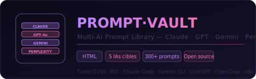
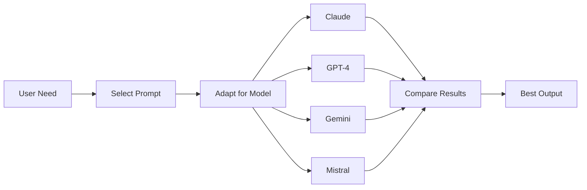

<div align="center">
  
  <br/><br/>

  [](LICENSE)
  [](#prompt-catalog)
  [](#claude-prompts)
  [](#chatgpt--gpt-4o-prompts)
  [](#gemini-prompts)
  [](#perplexity-prompts)
  [](#n8n-ai-node-prompts)
  [](#web-interface)
  [](https://github.com/Turbo31150/bibliotheque-prompts-multi-ia/stargazers)

  <br/>
  <h3>Multi-AI Prompt Library &mdash; 397+ Curated Prompts for Claude, GPT, Gemini, Perplexity &amp; n8n</h3>
  <p><em>The definitive prompt collection for the JARVIS ecosystem &mdash; every prompt tested, optimized, and documented for its target AI. Includes an interactive web UI for browsing, filtering, and exporting.</em></p>

  <br/>

  [Catalog](#prompt-catalog) &bull; [By AI](#prompts-by-ai) &bull; [Web UI](#web-interface) &bull; [Format](#prompt-format) &bull; [Installation](#installation) &bull; [Contributing](#contributing)
</div>

---


## How It Works




## Why PROMPT VAULT?

Prompt engineering is fragmented: what works on Claude fails on GPT, Gemini needs different structures, and n8n AI nodes have their own constraints. **PROMPT VAULT** solves this by providing a **centralized, categorized, and AI-specific prompt library** where every prompt is:

- **Tested** on its target AI model
- **Categorized** by domain and complexity
- **Tagged** for searchability
- **Versioned** with last-updated dates
- **JARVIS-integrated** where applicable

---

## Prompt Catalog

### By Category

| Category | Total | Claude | GPT | Gemini | Perplexity | n8n |
|:---------|------:|-------:|----:|-------:|-----------:|----:|
| **Development** | 85 | 32 | 22 | 16 | 8 | 7 |
| **Trading & Finance** | 68 | 24 | 14 | 18 | 12 | -- |
| **Automation & DevOps** | 62 | 18 | 12 | 14 | 6 | 12 |
| **Analysis & Research** | 56 | 18 | 14 | 12 | 12 | -- |
| **Content & Social Media** | 48 | 14 | 16 | 10 | 8 | -- |
| **System & Infrastructure** | 42 | 22 | 10 | 6 | 4 | -- |
| **Miscellaneous** | 36 | 10 | 10 | 8 | 8 | -- |
| **Total** | **397** | **138** | **98** | **84** | **58** | **19** |

### By Complexity

| Level | Count | Description |
|:------|------:|:------------|
| **Beginner** | 95 | Single-turn, direct instructions |
| **Intermediate** | 168 | Multi-step, structured output |
| **Advanced** | 98 | Multi-turn, tool use, agent patterns |
| **Expert** | 36 | System prompts, full agent configs |

---

## Prompts by AI

### Claude Prompts

**138 prompts** across three interfaces:

| Interface | Count | Highlights |
|:----------|------:|:-----------|
| **Claude Code** | 52 | System prompts, `CLAUDE.md` templates, agent patterns, MCP tool configs |
| **Claude API** | 48 | JSON structured outputs, tool use schemas, multi-turn conversation designs |
| **Claude Desktop** | 38 | MCP configurations, Cowork session prompts, JARVIS integration |

**Top Claude prompts:**
- `claude-code-scaffold-001` &mdash; Full Python project scaffolding with uv
- `claude-code-agent-pattern-003` &mdash; Autonomous agent with tool loop
- `claude-api-structured-output-012` &mdash; Complex JSON extraction pipeline
- `claude-desktop-mcp-config-007` &mdash; Multi-server MCP configuration

---

### ChatGPT / GPT-4o Prompts

**98 prompts** covering:

| Interface | Count | Highlights |
|:----------|------:|:-----------|
| **ChatGPT** | 42 | Conversation design, analysis, creative generation |
| **GPT-4o** | 32 | Vision tasks, structured outputs, function calling |
| **Assistants API** | 24 | Custom assistants with tools, retrieval, code interpreter |

---

### Gemini Prompts

**84 prompts** for:

| Interface | Count | Highlights |
|:----------|------:|:-----------|
| **Gemini CLI** | 30 | Shell commands, automated scripts, batch processing |
| **Gemini Live API** | 28 | Voice agents, real-time interactions, streaming |
| **Gemini API** | 26 | Vision, code generation, multi-modal analysis |

---

### Perplexity Prompts

**58 prompts** focused on:

| Use Case | Count |
|:---------|------:|
| Market research & competitive intelligence | 18 |
| Technical fact-checking & validation | 14 |
| News monitoring & trend analysis | 12 |
| Academic research & citation gathering | 8 |
| JARVIS automated surveillance | 6 |

---

### n8n AI Node Prompts

**19 prompts** for workflow automation:

| Node Type | Count |
|:----------|------:|
| OpenAI Chat node | 7 |
| Claude node | 5 |
| Gemini node | 4 |
| Custom AI agent node | 3 |

---

## Web Interface

The included `index.html` provides a fully interactive browsing experience:

**Features:**
- **Filter** by AI, category, complexity level
- **Full-text search** across all prompt titles and content
- **One-click copy** to clipboard
- **Export** selections as JSON, CSV, or PDF
- **Preview** expected output for each prompt
- **Dark mode** support

### Launch

```bash
# Option 1: Open directly
xdg-open index.html    # Linux
open index.html        # macOS

# Option 2: Serve locally
npx serve . -p 3000
# Then open http://localhost:3000
```

---

## Prompt Format

Every prompt follows a standardized JSON schema:

```json
{
  "id": "claude-code-scaffold-001",
  "title": "Scaffold Python project with uv",
  "ia": "claude-code",
  "category": "development",
  "complexity": "intermediate",
  "tags": ["python", "uv", "scaffold", "project-init"],
  "prompt": "Create a new Python project using uv with...",
  "expected_output": "A complete project structure with...",
  "variables": ["project_name", "python_version"],
  "jarvis_integration": true,
  "tested": true,
  "test_date": "2026-03-20",
  "model_version": "claude-3.5-sonnet",
  "last_updated": "2026-03"
}
```

### Schema Fields

| Field | Type | Required | Description |
|:------|:-----|:--------:|:------------|
| `id` | string | yes | Unique identifier (`{ai}-{category}-{seq}`) |
| `title` | string | yes | Human-readable prompt title |
| `ia` | string | yes | Target AI (claude-code, gpt-4o, gemini-cli, etc.) |
| `category` | string | yes | Domain category |
| `complexity` | enum | yes | beginner / intermediate / advanced / expert |
| `tags` | string[] | yes | Searchable tags |
| `prompt` | string | yes | The actual prompt text |
| `expected_output` | string | no | What the AI should produce |
| `variables` | string[] | no | User-replaceable placeholders |
| `jarvis_integration` | boolean | no | Whether it integrates with JARVIS |
| `tested` | boolean | yes | Has been tested on target AI |
| `test_date` | string | no | Date of last successful test |
| `model_version` | string | no | Specific model version tested |

---

## Installation

```bash
git clone https://github.com/Turbo31150/bibliotheque-prompts-multi-ia.git
cd bibliotheque-prompts-multi-ia
```

No dependencies required. The library is a standalone collection of prompts with an HTML interface.

### Project Structure

```
bibliotheque-prompts-multi-ia/
├── index.html               # Interactive web UI
├── README.md
├── prompts/                  # Prompts organized by AI
│   ├── claude/               # 138 Claude prompts
│   │   ├── code/             # Claude Code specific
│   │   ├── api/              # Claude API
│   │   └── desktop/          # Claude Desktop + MCP
│   ├── gemini/               # 84 Gemini prompts
│   │   ├── cli/
│   │   ├── live/
│   │   └── api/
│   ├── chatgpt/              # 98 GPT prompts
│   │   ├── chat/
│   │   ├── gpt4o/
│   │   └── assistants/
│   ├── perplexity/           # 58 Perplexity prompts
│   └── n8n/                  # 19 n8n AI node prompts
├── configs/                  # Tool-specific configurations
│   ├── claude_code.json      # CLAUDE.md templates
│   ├── gemini_cli.yaml       # Gemini CLI configs
│   └── openclaw.yaml         # OpenClaw patterns
├── scripts/                  # Management utilities
│   ├── validate.py           # Validate prompt JSON schema
│   ├── export.py             # Batch export (JSON/CSV)
│   └── stats.py              # Generate catalog statistics
├── export/                   # Pre-built exports
│   ├── all_prompts.json
│   └── all_prompts.csv
└── docs/                     # Technical documentation
```

---

## Contributing

Contributions are welcome. To add a new prompt:

1. **Fork** the repository
2. **Create** a JSON file in the appropriate `prompts/<ai>/` directory
3. **Follow** the schema format described above
4. **Test** the prompt on the target AI model
5. **Submit** a Pull Request with the label `new-prompt`

### Guidelines

- One prompt per JSON file
- File name must match the `id` field
- The `tested` field must be `true` before merging
- Include `expected_output` when possible
- Tag liberally for searchability


## What is This Collection?

A battle-tested library of **397+ prompts** optimized for multi-model AI workflows. Each prompt has been tested on Claude, GPT-4, Gemini, and Mistral to ensure consistent quality across models.

Unlike generic prompt collections, these are designed for **production use** — structured outputs, error handling, and model-specific adaptations built in.

## Usage Examples

```python
# Example 1: Use a prompt for code review
prompt = load_prompt("code-review/security-audit")
# → Returns a structured prompt that works on any model

# Example 2: Multi-model consensus
for model in ["claude", "gpt4", "gemini"]:
    result = query(model, prompt)
# → Compare outputs across models for reliability

# Example 3: Chain prompts for complex tasks
step1 = load_prompt("analysis/requirements")
step2 = load_prompt("code/generate")
step3 = load_prompt("test/validate")
# → Pipeline: analyze → generate → test
```

## Prompt Categories

| Category | Count | Use Case |
|----------|-------|----------|
| **Code Generation** | 45 | Python, TypeScript, SQL, Bash |
| **Analysis** | 38 | Data, market, code review |
| **Writing** | 52 | Technical docs, emails, proposals |
| **System** | 31 | DevOps, monitoring, alerts |
| **Trading** | 28 | Signals, risk, portfolio |
| **Voice** | 22 | Commands, intents, responses |
| **Automation** | 41 | n8n, workflows, scraping |
| **Creative** | 35 | Storytelling, branding, design |
| **Other** | 105 | Misc specialized prompts |

## Why Multi-Model?

Single-model prompts break when you switch providers. These prompts include **model-specific adaptations** — the same prompt works on Claude, GPT, Gemini, and Mistral with consistent output format.

---

MIT

This project is licensed under the MIT License. See [LICENSE](LICENSE) for details.

---

<div align="center">
  <br/>
  <strong>Franc Delmas (Turbo31150)</strong> &bull; <a href="https://github.com/Turbo31150">github.com/Turbo31150</a> &bull; Toulouse, France
  <br/><br/>
  <em>PROMPT VAULT &mdash; Multi-AI Prompt Library for the JARVIS Ecosystem</em>
</div>
